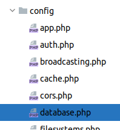

## Bases de datos con Laravel
* Laravel permite tener un control absoluto sobre la estructura de la base de datos.
* Con esto me refiero a que a través del proyecto podemos sobre todas las tablas de nuestro proyecto 
 ** crear
 ** borrar
 ** modificar
 ** poblar 
* Para este cometido está el concepto de las **migraciones** en laravel que son ficheros php que contiene las instrucciones necesarias para realizar estas operaciones

* Ademas usaremos comando de artisan para agilizar el proceso de creación y ejecución de las migraciones
### Configurar la base de datos
*Para configurar la base de datos, hemos de especificar los siguientes parámetros:
 
<ol>
 <li>localhost</li>
 <li>usuario</li>
 <li>password</li>
 <li>base de datos</li>
</ol>

* Como todas las configuraciones, debemos ir al fichero de configuración de bases de datos

  
Si vemos el contenido, vemos que es un array llamado **connections** el cual contiene tantas una serie de conexiones.

Podemos añadir más si necesitáramos, pero para este caso vamos a usar la ya conocida **mysql**

Si accedemos a ese elemento vemos su configuración 

) 

  
### Instalar las migraciones

### Crear una migración para cada tabla

### Ejecutar una migración

### Modificar una migración y volver a ejecutarla para que se actualice en la tabla

### Borrar las tablas con las  migraciones

### Cómo poblar las tablas

### Interaccionar una tabla con una aplicación en laravel

#### Crear un modelo 

#### Crear un modelo con tabla, migración y preparada para ser poblada

#### Visualziar los datos

#### Concepto de resource: un CRUD

#### Guardar datos de un formulario en una tabla

que queramos inco

